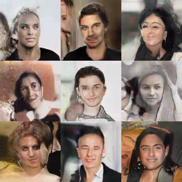
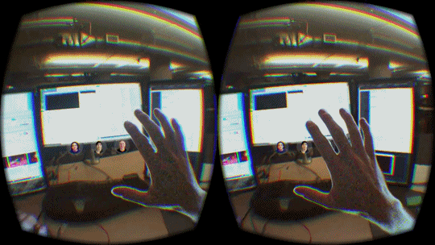

<h1 align="center">Hi 👋, I'm Sudipta Kumar Sarkar</h1>
<h3 align="center">A passionate AI Researcher/Engineer</h3>

  

- 🔭 I’m currently working on **Deep Learning**

- 🌱 I’m currently learning **LLM, Transformer, Computer Vision**

- 👯 I’m looking to collaborate on **GANs/VAE and DaGANs**

- 🤝 I’m looking for help with **GANs/VAE and DaGANs**

- 👨‍💻 All of my projects are available at [https://github.com/sudiptakrsarkarai?tab=repositories](https://github.com/sudiptakrsarkarai?tab=repositories)

- 📫 How to reach me **sudeeptasarkar780@gmail.com**
  

  

 
<h3 align="left">Connect with me:</h3>

 

<h3 align="left">Languages and Tools:</h3>

              

&nbsp;

